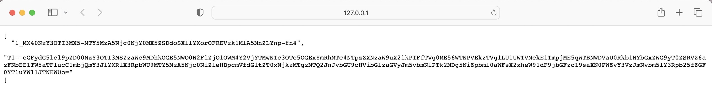
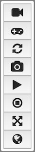
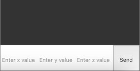
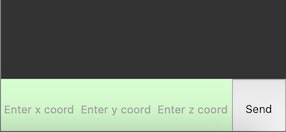
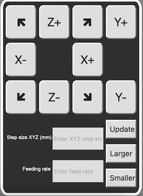
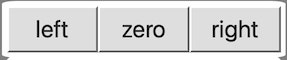

# Documentation Of Javascript Web Client

## Introduction
This documentation provides a comprehensive overview of the JavaScript code used to interact with the OpenTok API for video communication and control. The code facilitates video streaming, text chat, video manipulation, and movement control within a web application.

## Prerequisites
Below is a list of prerequisites or requirements before diving into the code:

 - Download OpenTok, Flask and Flask-CORS before running "Token_generator.py".

 - OpenTok API Key, Session ID, and Token should be obtained and assigned to appropriate variables in the config.js file.

 - Or please provide the base URL of the server to retrieve the session ID and token.

 - Any IDEs that can accommodate Python and JavaScript are required to run this web client successfully; some suggestions are VS studio or WebStorm.

 ## Getting Started
 Below is a short guide on how to start using the web client:

 1. Run "Token_generator.py"

 2. Copy the base URL of your local flask server and replace the `SAMPLE_SERVER_BASE_URL` variable inside "config.js" with your URL.

 3. Open the HTML file while the Flask local server is on. Now, you are connected to the Opentok video chat session. The session ID and Token will be automatically fetched.

 4. In order for the other party of the video chat to connect to the same session, open your local server in Chrome or any other web browser and copy the Session ID and Token. 
 

 5. Provide the session ID and Token to the other party, then they should copy them into the `SESSION_ID` and `TOKEN` variables inside "config.js".

 6. Now, both parties are connected to the same Opentok video chatting session.

## How to use the Web Client
In this section, the primary function of the web client will be discussed.

### Tool Box
 1. Video window toggle: You can hide or unhide the publisher video window.

 2. Jogging mode: allows you to change between manual mode (control using text chat) and jogging mode (control using control panel).

 3. Switch display: Swaps the publisher and subscriber video display.

 4. Screenshot: Takes a screenshot of the subscriber window

 5. Start screen sharing: Start sharing, which will replace your and the other party's subscriber window with your shared screen.

 6. End screen sharing: Stops the screen sharing and returns the subscriber windows to its original display.

 7. Full screen: Hiddes the publisher video window, text chat, and jogging control panel. 

 8. Global mode: By default, the manual mode text chat takes in coordinates that use a body-fixed coordinate system; global mode, on the other hand, makes the text chat take in coordinates that use an absolute coordinate system.

 

### Manual Mode Controller
1. Local mode: As discussed before, a text box will take in coordinates in a body-fixed coordinate system when the local mode is on the Manual mode. 

2. Global mode: As discussed before, the Manual mode text box will take in coordinates in an absolute coordinate system when global mode is on.

### Jogging Mode Controller
 1. XYZ control: After updating the step size and feed rate, you can use the jogging keys to control the gantry.

 2. Update step size and feed rate: Enter your desired feed rate and step size into the respective text boxes on the jogging panel, then press update to set these changes into effect.

 3. Smaller and larger: smaller decreases the current step size by ten times, and larger increases the current step size by ten times.

### Eye Homing Controller
1. Right: makes the gantry auto-focus on the patient's right eye.

2. Left: makes the gantry auto-focus on the patient's left eye.

3. Zero: makes the gantry go to the middle of the absolute coordinate system.

## Code Overview
The specific logic and code explanations are discussed in detail through the extensively commented code themselves. This section will discuss a general overview of the web client code's structure.

There are two significant components to the web client code:
 1. Token_generator.py: This contains the code to start the flask server and get the session ID and tokens.

 2. Web-client javascript

 2.1 app.js: This file contains the client-side JavaScript code for a web application. It interacts with the OpenTok API to enable video communication and control features. Below is a breakdown of the main sections and functionalities within the file:

 2.2 app.css: This CSS file contains styling rules using CSS for a web client application. The purpose of this file is to provide consistent styling and layout for the application's web pages, contributing to the user interface and overall user experience.

 2.3 config.js: This file contains the configuration settings required to integrate the OpenTok video communication platform into a web application. It specifies how to obtain the session ID and token necessary for establishing video sessions between participants.

 2.4 index.html:  It contains all the libraries used to build this web client. Plue this file also defines the structure of all the elements defined in app.css